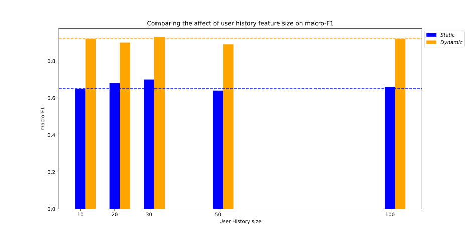
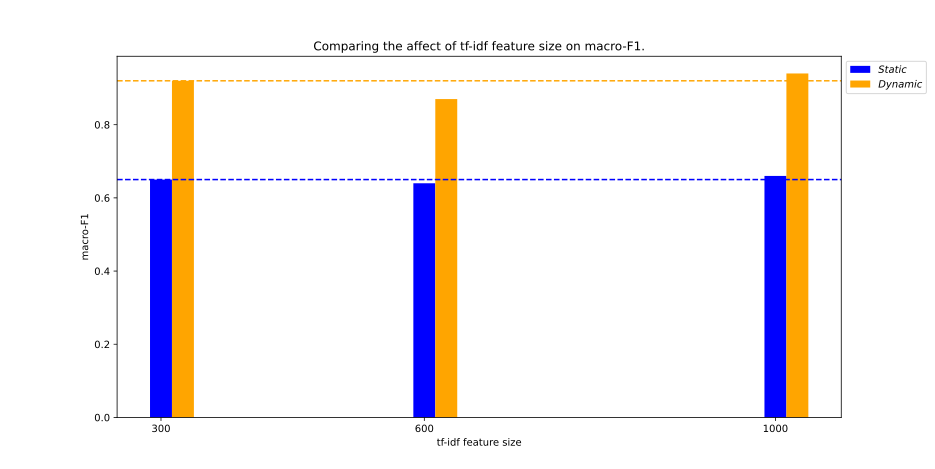
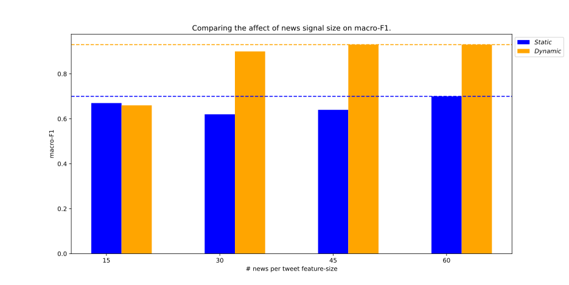

# RETINA
Code and Sample data for RETINA (Retweeter Identifier Network with  Exogenous Attention)

      Hate is the New Infodemic: A Topic-aware Modeling of Hate Speech Diffusion on Twitter
      - Subhabrata Dutta, Sarah Masud, Sakshi Makkar, Chhavi Jain, Vikram Goyal,Amitava Das, Tanmoy Chakraborty
      
## Ablation Summary
1 **User history feature size**

2 **Tfidf features size**

3 **News per tweet size**

Details about the results available under the `ablation_results` folder
